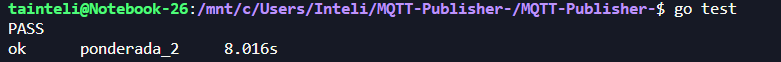

# Teste de um simulador de dispositivos IoT

O simulador utiliza a linguagem de programação Go e o protocolo MQTT para simular o envio de dados de dispositivos IoT para um broker MQTT.

## Requisitos

Para executar o simulador e os testes, é necessário ter o seguinte instalado em seu sistema:

- Go 
- Broker MQTT (como o Mosquitto, em execução local ou remota)

## Uso

Para iniciar o simulador, execute:

``
go run publisher.go
``

Isso iniciará o processo de publicação de mensagens MQTT para o broker configurado.

## Testes

Para executar os testes automatizados, no diretório do projeto, execute:

``
go test
``

Os testes verificarão se o simulador está cumprindo os seguintes critérios:

1. **Recebimento**: Garante que os dados enviados pelo simulador são recebidos pelo broker.
2. **Validação dos Dados**: Garante que os dados enviados pelo simulador chegam sem alterações.
3. **Confirmação da Taxa de Disparo**: Garante que o simulador atende às especificações de taxa de disparo de mensagens dentro de uma margem de erro razoável.

## Resultado Esperado 

O resultado da execução do comando go test mostrou que todos os testes unitários no pacote ponderada_2 foram concluídos com sucesso. Tendo os seguintes resultados significativos:

- *"ok"* 
  
   Indica que o pacote de testes foi compilado e executado sem erros.

     

- *"ponderada_2"* 
  
   É o nome do pacote que foi testado.
     
     

- *"8.016s*" 
  Representa o tempo total levado para executar todos os testes no pacote. Neste caso, foram aproximadamente 8 segundos.

     
   

Quando é executado o comando go test, o Go compila os testes para o pacote atual e, em seguida, executa os testes compilados reportando os resultados. Um teste é considerado bem-sucedido se não provocar uma falha, que pode ser causada por uma afirmação não satisfeita (por exemplo, uma chamada a t.Errorf() ou t.Fatalf() dentro do teste).

O fato de que o teste passou sem nenhuma indicação de falha (como FAIL) ou erros significa que todas as funções de teste no pacote ponderada_2 atenderam às expectativas definidas dentro deles. As afirmações e verificações codificadas nos testes não encontraram inconsistências ou problemas no código que estava sendo testado.

Portanto, o resultado esperado aqui é que o simulador de dispositivos IoT está funcionando conforme definido pelos testes unitários, dentro das condições que esses testes verificam.

 

# Simulador de dispositivos IoT | Pusblisher 
 

Este script Python utiliza a biblioteca Paho MQTT para conectar-se a um broker MQTT local e publicar mensagens JSON aleatórias. Os dados são carregados de um arquivo `dados.json` e, a cada iteração, um campo específico dos dados é alterado aleatoriamente antes da publicação.

- Python 3.x
- Paho MQTT (`pip install paho-mqtt`)
- Arquivo `dados.json` no mesmo diretório do script

## Funcionamento

1. O script carrega o JSON do arquivo `dados.json`.
2. Link para os dados utilizados: https://sigmasensors.com.br/produtos/sensor-de-radiacao-solar-sem-fio-hobonet-rxw-lib-900 
3. Em um loop infinito, seleciona aleatoriamente um campo para modificar e publica os dados no tópico "test/topic".
4. A publicação ocorre a cada 2 segundos, até que o script seja interrompido manualmente.

## Uso

1. Certifique-se de que o broker MQTT esteja rodando na porta 1891.
2. Coloque o arquivo `dados.json` no mesmo diretório do script.
3. Execute o script: `python script.py`.
4. Interrompa com `Ctrl+C` para encerrar a publicação.

